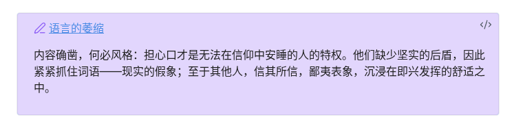

# EPUB Marginalia

[中文](README.md) | **English**

Read EPUB ebooks inside Obsidian with a built-in reader, margin notes, vault excerpts, deep links back to the source, reading themes, split-view co-reading, and multilingual UI.

## Installation

### From Obsidian Community Plugins

1. Open **Settings → Community plugins**
2. Disable **Restricted mode** if needed, then click **Browse**
3. Search for **EPUB Marginalia**
4. Click **Install**, then **Enable**

### Manual install

1. Download `main.js`, `manifest.json`, and `styles.css` from the [latest release](https://github.com/chengshans/ob-epub-reader/releases)
2. Copy them into `.obsidian/plugins/ob-epub-reader/` in your vault
3. Enable **EPUB Marginalia** under **Settings → Community plugins**

## Features

- **Built-in reader** — Open any `.epub` file in your vault from the file explorer
- **TOC and notes sidebar** — Chapter outline (auto-highlights current chapter while reading) and annotations for the current book (search and filter by color or note type)
- **EPUB bookshelf** — Browse all EPUBs in the vault with progress and cumulative reading time (can be disabled in settings)
- **Reading progress** — Auto-saved position; excerpt frontmatter stores percent, chapter, and reading time
- **Highlights and margin notes** — Select text to highlight (yellow/red/green/blue/purple) or add a thought; highlight/recolor auto-copies excerpts
- **Copy and highlight** — Color dots copy excerpts; with annotations off, dots copy only (optional color); split-view co-reading can auto-insert into the recently edited Markdown note
- **Five note types** — Note, Inspiration, Practice, Revisit, Question; labels and icons are configurable in settings
- **Excerpt export** — Annotations sync to Markdown excerpt files with five configurable excerpt link formats (including **plain text** — selected passage only, ideal for copying elsewhere); excerpt folder and filename support `{filefolder}`, `{title}`, and `{filename}` placeholders
- **Deep links** — Wiki links `#cfi=...` jump from excerpts to the EPUB passage; legacy `obsidian://ob-epub-goto` URLs and old block-ref formats are auto-migrated
- **Reading settings panel** — Toolbar ⚙ popover: font size slider, side margins, six reading themes, highlight opacity, auto-paste toggle
- **Reading modes** — Paginated or scroll; adjustable font size and side margins (12–120 px)
- **Toolbar placement** — Top (inside reader) or bottom (pinned to Obsidian status bar), with progress bar
- **Reading themes** — Follow Obsidian, White, Yellow, Green, Sepia, Dark (switch in reading settings; set default in settings)
- **Keyboard and mouse** — Arrow keys, Page Up/Down, and mouse wheel for page turns
- **Multilingual UI** — English, Simplified Chinese, Traditional Chinese, Japanese; follow Obsidian or pick a locale
- **Feature toggles** — Disable annotations & excerpts or bookshelf independently for read-only / copy-only mode

## Usage

### Open a book

- Click any `.epub` file in the file explorer
- Command palette: **Open EPUB bookshelf** — Browse all EPUBs in the vault and their progress
- Command palette: **Open in EPUB reader** — Open the currently selected EPUB file

### Highlights and margin notes

1. Select text in the reader to open the context menu
2. Pick a highlight color, or choose **Annotate** to add a thought (one of five note types)
3. Excerpts are written to a Markdown file under `{excerpt folder}/` using your filename template (default `{title} excerpts.md`)
4. Click the note icon beside highlighted text, or use the sidebar list, to view, edit, or delete annotations

**Split-view co-reading**: With EPUB and Markdown side by side, **Copy** or a color dot writes the excerpt to the clipboard. When **Auto-paste excerpts** is on (🌟 in the reading settings panel), the excerpt also inserts at the last cursor in the recently edited note (reading mode: clipboard only).

Example excerpt block (default **Callout + title link** format):

```markdown
> [!ob-epub|yellow] [[book.epub#cfi=/6/14!/4/2/1:0&end=...|Chapter 3]]
> Selected passage text

<!-- ob-epub-note-type: inspiration -->
Optional thought text

---
```

### Excerpt link formats

Under **Settings → Excerpt link format**, choose one of five presets. Changes apply only to new annotations; for existing excerpts, use **Convert existing excerpt links → Convert now** to batch-rewrite.

| Preview | ID | Setting name | Write example | Color |
| :--: | ---- | ------------ | ------------- | ----- |
|  | `callout-title` | Callout + title link | `> [!ob-epub\|purple] [[book.epub#cfi=...\|Chapter]]` + `> passage` | callout metadata |
|  | `inline-suffix` | Passage + trailing source link | `Passage. [[book.epub#cfi=...\|Source]]` | not stored; reads back as `yellow` |
|  | `inline-colored` | Colored passage + trailing source link | `<span style="color: #8b5cf6;">Passage</span> [[...\|Source]]` | span hex → nearest highlight color |
|  | `wiki-text-alias` | Link as passage text | `[[book.epub#cfi=...\|Full excerpt text]]` | not stored; reads back as `yellow` |
| — | `plain-text` | Plain text | Selected passage only; no links or comments | not written to file; reads back as `yellow`; no back-to-source |

Plain text example (same content in excerpt files and clipboard):

```markdown
In investing, cycles are the most reliable force. Fundamentals, psychology, and the rise and fall of prices and returns create chances to err—or to profit from others' mistakes. These are known facts.
```

Excerpt files, clipboard, and copy output match the example above: **selected passage only** — no links, comments, or location metadata.

Thought block (shared by all five formats; optional with plain text):

```markdown
<!-- ob-epub-note-type: inspiration -->
Thought content
```

Multi-line excerpts: formats 2/3 (`inline-suffix`, `inline-colored`) and format 5 (`plain-text`) keep line breaks; format 4 (`wiki-text-alias`) collapses line breaks to a single line (space-joined) when writing; escape `\|` and `\]` in aliases.

### Back to source

Wiki links in excerpts (`[[book.epub#cfi=...|...]]`), **Source** links, or `ob-epub` callout title links all jump to the matching passage in the EPUB reader (works in split view). **Plain text** has no links and does not support back-to-source.

> Legacy `obsidian://ob-epub-goto?file=...&cfi=...` URLs, old block-ref links, and legacy CFI-comment layouts are migrated to the currently selected excerpt format on first plugin load or via manual conversion.

### Reading settings

Click **⚙** on the toolbar to open the reading settings panel:

- **Font size** — Slider or A-/A+ (10–32 px, persisted)
- **Side margins** — Slider or ◧-/◧+ (12–120 px; works in paginated and scroll modes)
- **Reading theme** — Six theme swatches for instant switching
- **Highlight opacity** — Adjust highlight layer strength in the reader (shown when annotations are enabled)
- **Auto-paste** — 🌟/★ toggles whether split-view co-reading inserts into Markdown notes

The toolbar also offers **paginated/scroll** mode and **◀/▶** page turns. **Toolbar placement** (top or bottom, with progress bar) is configured in settings.

### Reading themes

The **⚙ Reading settings** panel offers six theme swatches for instant switching. **Settings → Default reading theme** sets the initial theme for newly opened books.

| Preview | Theme | Background | Description |
| :--: | ----- | ---------- | ----------- |
|  | Follow Obsidian | Editor theme | Matches Obsidian editor colors; follows light/dark mode |
|  | White | `#FFFFFF` | White background, dark gray text — general reading |
|  | Yellow | `#FAF9DE` | Warm pale yellow — easier on the eyes for long sessions |
|  | Green | `#E3EDCD` | Soft green — classic eye-comfort mode |
|  | Sepia | `#F4ECD8` | Warm brown tone — paper-like feel |
|  | Dark | `#1C1C1E` | Dark gray background, light text — low-light reading |

### Note types and icons

When adding a thought, pick one of five types. Its icon appears beside the highlight in the reader and in the sidebar list. Labels and icons are customizable under **Settings → Note types** (internal `id` values stay fixed).

| Icon | Type | id | Best for |
|------|------|----|----------|
| 📝 | Note | `note` | General notes and summaries |
| 💡 | Inspiration | `inspiration` | Insights, associations, ideas |
| ✅ | Practice | `practice` | Actions or methods you plan to try |
| 🔁 | Revisit | `revisit` | Passages worth reading again |
| ❓ | Question | `question` | Unclear points to look up later |

Icon size and position can be adjusted under **Settings → Note icons** (default 20 px diameter, 2 px offset to the right of the highlight).

## Settings

Configure under **Settings → EPUB Marginalia** (grouped, collapsible sections):

### General

| Option | Description | Default |
|--------|-------------|---------|
| Display language | Plugin UI (English / Simplified Chinese / Traditional Chinese / Japanese / Follow Obsidian); does not change existing excerpt files | Follow Obsidian |

### Reader

| Option | Description | Default |
|--------|-------------|---------|
| Default reading mode | Paginated / scroll | Scroll |
| Default font size | Reader font size (px) | 16 |
| Side margins | Horizontal padding of reading content (px) | 12 |
| Default reading theme | Follow Obsidian / White / Yellow / Green / Sepia / Dark | Follow Obsidian |
| Toolbar placement | Top (in reader) / Bottom (Obsidian status bar) | Bottom |
| Auto-paste excerpts | Insert copied excerpts into the most recently edited Markdown note | On |

### Annotations & excerpts

This group can be disabled entirely. When off, selection copies only (optional color); no highlights or excerpt writes.

| Option | Description | Default |
|--------|-------------|---------|
| Excerpt folder | Directory for excerpt Markdown; supports `{filefolder}` (EPUB directory), e.g. `{filefolder}/anno` | `epub-books/anno` |
| Excerpt filename | Supports `{title}` (book title) and `{filename}` (EPUB filename), e.g. `{title} excerpts.md` | `{title} excerpts.md` |
| Excerpt link format | Five presets; see above | Callout + title link |
| Default highlight color | Fallback when parsing/converting formats that do not store color | Yellow |
| Excerpt callout opacity | Background strength of ob-epub callouts in excerpt files | 20% |
| Convert existing excerpt links | Batch-rewrite all excerpt files to the current format | — |
| Check excerpt metadata | Verify frontmatter `epub-source` points to a valid EPUB | — |
| EPUB highlight opacity | Opacity of highlight layers in the reader | See settings |
| Note types | Labels and icons for five note categories (fixed ids; reset to defaults available) | See settings tab |
| Note icon size | Diameter of note icons beside highlights (px) | 20 |
| Note icon position | Horizontal / vertical offset from highlight (px) | 2 / 0 |

### Bookshelf & shortcuts

This group can be disabled (does not affect **Open in EPUB reader**).

| Option | Description | Default |
|--------|-------------|---------|
| EPUB bookshelf | Sidebar bookshelf, ribbon icon, and **Open EPUB bookshelf** command | On |

## Data storage

| File | Location | Contents |
|------|----------|----------|
| Excerpt Markdown | `{excerpt folder}/` (filename configurable; default `{title} excerpts.md`) | Highlights and margin notes; frontmatter includes `epub-source` and reading progress |
| `data.json` | `.obsidian/plugins/ob-epub-reader/` | Plugin settings (not annotations or progress) |

Progress fields in excerpt frontmatter: `progress-percent`, `progress-cfi`, `progress-chapter`, `last-read`, `reading-time-seconds` (cumulative reading time in seconds).

Older versions stored annotations and progress in `data.json` or `reading-progress.json`. The plugin migrates them into excerpt frontmatter on first load. You may delete `reading-progress.json` after migration.

## Requirements

- Obsidian 1.8.0+
- Desktop only

## Development

```bash
npm install
npm run build    # output to dist/
npm run release  # build + zip for GitHub release
npm run dev      # watch mode
npm test         # run unit tests
```

To deploy directly into a vault plugin folder:

```bash
PLUGIN_DIR="/path/to/vault/.obsidian/plugins/ob-epub-reader" npm run build
```

## License

MIT
