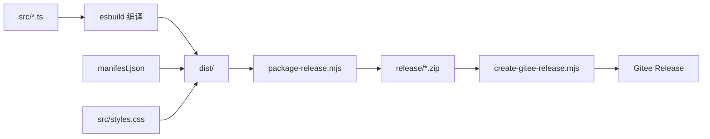

# ob-epub 构建与发布流程

> 版本：**v1.1.1**  
> 日期：2026-06-09  
> 仓库：https://gitee.com/mmlya/ob-epub-reader

本文档说明插件从源码编译、本地调试、打包到 Gitee Release 发布的完整流程。

---

## 1. 流程总览



| 阶段 | 命令 | 产出 |
|------|------|------|
| 开发调试 | `npm run dev` | `dist/`（监听热编译） |
| 生产构建 | `npm run build` | `dist/main.js` + 元数据 |
| 打包 | `npm run release` | `release/ob-epub-reader-{version}.zip` |
| 发布 | `npm run release:publish` | Gitee Release + 附件 |

---

## 2. 环境准备

```bash
cd /opt/work_space/ob-epub
npm install
```

依赖：

- **esbuild** — TypeScript 打包
- **epub.js** — 运行时依赖，打入 `main.js`
- **obsidian** — 插件 API 类型（external，不打包）

---

## 3. 开发模式

```bash
npm run dev
```

- 使用 `esbuild.context().watch()` 监听 `src/` 变更
- 每次编译后自动复制 `manifest.json`、`styles.css` 到输出目录
- 默认输出到 `dist/`

### 直接部署到 Vault

设置 `PLUGIN_DIR` 可跳过手动复制，编译结果直接写入 Obsidian 插件目录：

```bash
PLUGIN_DIR="/path/to/vault/.obsidian/plugins/ob-epub-reader" npm run dev
```

在 Obsidian 中重载插件（`Ctrl/Cmd + R` 或关闭再打开插件）即可看到改动。

---

## 4. 生产构建

```bash
npm run build
```

`esbuild.config.mjs` 行为：

| 配置项 | 值 |
|--------|-----|
| 入口 | `src/main.ts` |
| 格式 | CommonJS (`cjs`) |
| 目标 | Node 18 |
| external | `obsidian`、`electron`、CodeMirror 等 |
| sourcemap | 生产模式关闭 |
| 输出目录 | `PLUGIN_DIR` 或默认 `dist/` |

构建完成后 `dist/` 包含三个可安装文件：

```
dist/
├── main.js        # 打包后的插件主程序
├── manifest.json  # 插件元数据（版本号来源）
└── styles.css     # 阅读器样式
```

---

## 5. 打包 Release

```bash
npm run release
```

等价于 `build` + `scripts/package-release.mjs`：

1. 读取 `manifest.json` 中的 `version`（当前 `1.1.1`）
2. 校验 `dist/` 下三个必需文件存在
3. 生成 `release/ob-epub-reader-{version}.zip`（扁平结构，无子目录）

zip 内容即为 Obsidian 插件目录所需的全部文件，用户解压后可直接使用。

---

## 6. 发布到 Gitee

### 6.1 前置条件

1. **Gitee 私人令牌**：在 Gitee → 设置 → 私人令牌 创建，需 `projects` 权限
2. 设置环境变量（二选一）：

```bash
export GITEE_ACCESS_TOKEN="你的令牌"
# 或
export GITEE_TOKEN="你的令牌"
```

3. 可选覆盖仓库信息：

```bash
export GITEE_OWNER="mmlya"          # 默认
export GITEE_REPO="ob-epub-reader"  # 默认
```

### 6.2 发布命令

```bash
# 1. 确保版本号已更新（manifest.json + package.json）
# 2. 构建并打包
npm run release

# 3. 提交代码并打 tag
git add -A && git commit -m "chore: release v1.1.1"
git tag -a v1.1.1 -m "EPUB Reader v1.1.1"
git push origin main
git push origin v1.1.1

# 4. 创建 Gitee Release 并上传 zip
npm run release:publish
```

### 6.3 发布脚本做了什么

`scripts/create-gitee-release.mjs`：

1. 调用 Gitee API `POST /repos/{owner}/{repo}/releases` 创建 Release
   - `tag_name`: `v{version}`（如 `v1.1.1`）
   - `target_commitish`: `main`
   - `body`: 自动生成的安装说明
2. 调用 `POST .../releases/{id}/attach_files` 上传 zip 附件
3. 输出 Release 页面 URL

### 6.4 已发布版本

| 版本 | Tag | Release 地址 |
|------|-----|-------------|
| 1.1.1 | `v1.1.1` | https://gitee.com/mmlya/ob-epub-reader/releases/tag/v1.1.1 |

---

## 7. 用户安装方式

从 Gitee Release 下载 `ob-epub-reader-{version}.zip`：

1. 解压到 Vault 的 `.obsidian/plugins/ob-epub-reader/`
2. 确认目录内有 `main.js`、`manifest.json`、`styles.css`
3. Obsidian → 设置 → 社区插件 → 启用 **EPUB Reader**

---

## 8. 版本号管理

发布新版本时需同步修改：

| 文件 | 字段 |
|------|------|
| `manifest.json` | `version` |
| `package.json` | `version` |

tag 命名规则：`v` + `manifest.json` 中的版本号（如 `v1.2.0`）。

---

## 9. 目录与忽略规则

```
ob-epub/
├── src/                          # TypeScript 源码
├── dist/                         # 构建产物（.gitignore）
├── release/                      # 发布 zip（.gitignore）
├── scripts/
│   ├── package-release.mjs       # 打包 zip
│   └── create-gitee-release.mjs  # Gitee Release 发布
├── esbuild.config.mjs            # 构建配置
├── manifest.json                 # 插件元数据
└── package.json                  # npm 脚本
```

`dist/`、`release/` 不纳入版本控制，仅通过 Gitee Release 附件分发编译产物。

---

## 10. 常见问题

### Q: `npm run release:publish` 报「请设置 GITEE_ACCESS_TOKEN」

未配置 Gitee 令牌。按 §6.1 设置环境变量后重试。

### Q: Release 已存在，重复发布失败

Gitee 不允许同一 `tag_name` 创建多个 Release。需先删除旧 Release，或发布新版本（更新 `manifest.json` 版本号 + 新 tag）。

### Q: 本地调试改了代码但 Obsidian 没变化

1. 确认 `npm run dev` 正在运行
2. 确认 `PLUGIN_DIR` 指向正确的 Vault 插件目录
3. 在 Obsidian 中重载插件

### Q: zip 解压后插件无法加载

检查 zip 是否为扁平结构（三个文件在根目录，无额外嵌套文件夹）。`package-release.mjs` 使用 `zip -j` 确保此结构。
