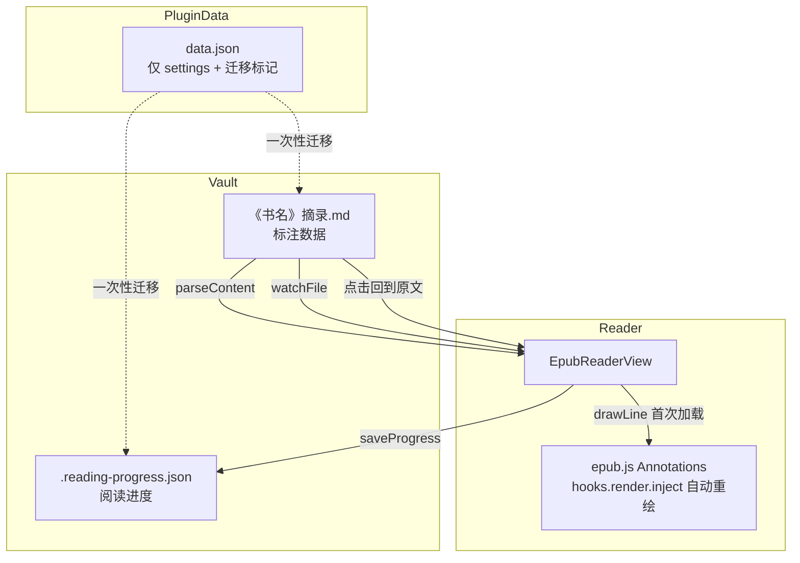

# ob-epub 问题排查与修复记录

> 版本：**v1.1.0**（提交 `41e482e`）  
> 日期：2026-06-09

本文档汇总 EPUB 阅读器插件在 v1.1.0 之前遇到的主要问题、根因分析与对应修复方案。

---

## 1. 原文不显示高亮

### 现象

- 摘录 Markdown 中已有标注记录
- 点击「回到原文」可跳转到正确段落
- 但 EPUB 阅读器正文中看不到彩色高亮

### 根因

epub.js 的 `Annotations` 类在 `hooks.render` 上注册了 `inject` 钩子，**每次章节渲染时会自动**将已注册注解附加到当前视图。

旧代码在每次 `rendered` 事件后又调用 `redrawHighlightsForPage()` → `annotations.add()`，导致：

1. `_annotationsBySectionIndex[sectionIndex]` 数组重复追加相同 hash
2. 每次 `inject` 运行时同一 hash 被处理多次，marks-pane 创建多层叠加 SVG 矩形
3. 多层 `fill-opacity` 累积后高亮变不可见或发黑

此外，`injectAnnotationStyles()` 将 CSS 注入 **iframe 内部文档**，而 marks-pane 的高亮 SVG 渲染在 **外层 Obsidian 文档**，该注入完全无效。

### 修复

**文件：** `src/EpubReaderView.ts`

| 改动 | 说明 |
|------|------|
| 删除 `redrawHighlightsForPage()` | 翻页重绘交给 epub.js `inject` 钩子 |
| 删除 `injectAnnotationStyles()` | 移除无效的 iframe CSS 注入 |
| 调整 `rendered` 事件 | 仅在首次加载时调用 `refreshHighlights()`，延迟 80ms → 150ms |
| 保留 `refreshHighlights()` | 书籍打开、vault 文件变更时全量刷新 |

---

## 2. 左侧边栏「标注」Tab 不显示高亮列表

### 现象

侧边栏标注 Tab 显示「暂无标注」，但右侧摘录笔记中已有标注内容。

### 根因

与问题 1 同源：`refreshHighlights()` 从 vault 解析标注后若 `drawLine` 因重复注册失败，侧边栏 `renderNotesPanel()` 虽在 `refreshHighlights` 末尾被调用，但若解析本身失败（如 CFI 提取 regex 不匹配）则列表为空。

v1.1.0 之前已增强 `AnnotationVaultStore.parseContent()` 的 CFI 提取逻辑；配合问题 1 的高亮重绘修复后，侧边栏与原文显示恢复正常。

### 修复

**文件：** `src/AnnotationVaultStore.ts`（此前已改）、`src/EpubReaderView.ts`

- `extractCfiFromChunk()` 增强 URL 解析，兼容多种链接格式
- `refreshHighlights()` 成功后调用 `renderNotesPanel()` 刷新侧边栏

---

## 3. 插件持续创建 / 写入 data.json

### 现象

`.obsidian/plugins/ob-epub-reader/data.json` 在每次翻页时被更新。

### 根因

`ProgressStore` 在每次 `relocated` 事件（翻页）时通过 Obsidian 插件 API 的 `saveData()` 写入 `data.json.progress`。

标注数据已迁移到 vault Markdown（`《书名》摘录.md`），但阅读进度仍存于 `data.json`。

### 修复

**文件：** `src/ProgressStore.ts`、`src/main.ts`

| 改动 | 说明 |
|------|------|
| 进度存储位置 | `{excerptFolder}/.reading-progress.json`（默认 `co-books/.reading-progress.json`） |
| 构造函数 | `ProgressStore(app, settings)`，不再依赖 `Plugin.loadData/saveData` |
| 一次性迁移 | `migrateProgressFromDataJson()` 将旧 `data.json.progress` 迁入 vault 后删除 |
| 设置变更 | `saveSettings()` 中调用 `progressStore.updateSettings()` |

### data.json 当前用途

迁移完成后，`data.json` 仅保留：

- `settings` — 插件设置
- `legacyGotoLinksFixed` — 一次性迁移标记

不再写入 `progress` 或 `annotations`。

---

## 4. 点击「回到原文」无反应

### 现象

摘录笔记中的 `[回到原文](obsidian://ob-epub-goto?...)` 链接点击后无任何效果；此前曾正常工作。

### 根因

1. **链接绑定失败：** Obsidian 渲染 Markdown 时可能改写 `href`（或移至 `data-href`），原先 post-processor 仅匹配 `a[href*="ob-epub-goto"]`，导致点击事件未绑定
2. **分栏焦点策略：** EPUB 已在分栏打开且当前已在同一 CFI 位置时，`openEpubAtCfi` 刻意不切换焦点到 EPUB 窗格，`display(sameCfi)` 也为无操作，用户感知为「无反应」
3. **导航互斥：** `navigateToCfi` 在 `isNavigating === true` 时静默返回，快速连续点击会被丢弃

### 修复

**文件：** `src/ExcerptGotoHandler.ts`、`src/main.ts`、`src/EpubReaderView.ts`

| 改动 | 说明 |
|------|------|
| document 级 capture 点击拦截 | 在 capture 阶段统一处理，不依赖 post-processor 是否成功绑定 |
| `getAnchorGotoHref()` | 兼容 `href`、`data-href`、`anchor.href`、已绑定 `dataset` |
| `parseAnchorGoto()` | 优先读取 `data-ob-epub-goto-file/cfi` 缓存 |
| 始终 `revealLeaf` | 点击「回到原文」后聚焦 EPUB 阅读器窗格 |
| 导航排队 | `pendingNavigateCfi` 在 `isNavigating` 期间缓存，完成后继续跳转 |

---

## 架构与数据流（修复后）



---

## 涉及文件一览

| 文件 | 主要变更 |
|------|----------|
| `src/EpubReaderView.ts` | 高亮重绘逻辑、导航排队 |
| `src/AnnotationVaultStore.ts` | CFI 解析、文件监听防抖 |
| `src/ProgressStore.ts` | vault JSON 存储进度 |
| `src/ExcerptGotoHandler.ts` | capture 点击、链接 href 兼容 |
| `src/main.ts` | 进度迁移、EPUB 窗格聚焦 |
| `manifest.json` | 版本号 1.0.0 → 1.1.0 |

---

## 验证清单

- [ ] 打开 EPUB，已有标注在原文显示彩色高亮
- [ ] 左侧「标注」Tab 列出所有标注，支持跳转 / 编辑 / 删除
- [ ] 翻页后高亮仍正确显示（不重复、不消失）
- [ ] 摘录笔记中点击「回到原文」跳转到 EPUB 并聚焦阅读器
- [ ] 点击 callout 区域（非链接文字）也可跳转
- [ ] 翻页后 `data.json` 不再频繁更新；进度写入 `{excerptFolder}/.reading-progress.json`
- [ ] 新建标注后摘录 Markdown 与阅读器同步

---

## 相关提交

```
41e482e fix: 修复高亮显示、回到原文跳转与进度存储  (v1.1.0)
571f01b fix: 修复 EPUB 原文高亮不显示
de2fe23 fix: 修复回到原文闪退并支持分栏点击定位
ca25255 feat: 以 Vault Markdown 为唯一数据源合并标注与摘录
```
