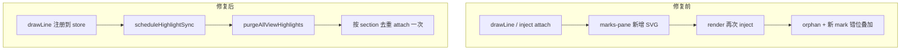
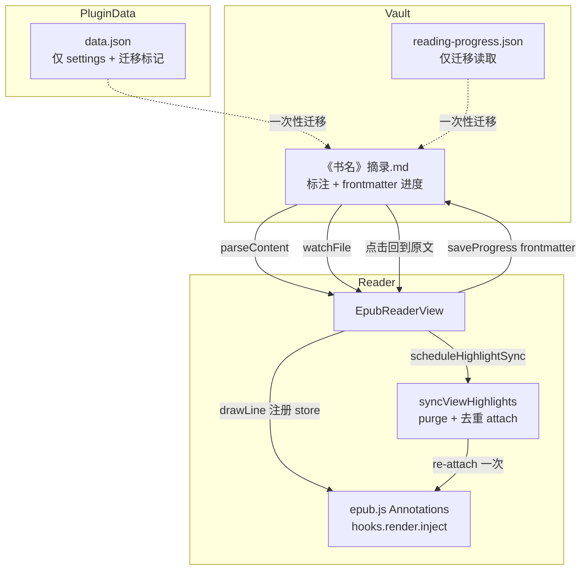

# ob-epub 问题排查与修复记录

> 最新版本：**v1.2.5**  
> 最近更新：2026-06-11

本文档汇总 EPUB 阅读器插件遇到的主要问题、根因分析与对应修复方案。

---

## 1. 原文不显示高亮

### 现象

- 摘录 Markdown 中已有标注记录
- 点击「回到原文」可跳转到正确段落
- 但 EPUB 阅读器正文中看不到彩色高亮

### 根因

epub.js 的 `Annotations` 类在 `hooks.render` 上注册了 `inject` 钩子，**每次章节渲染时会自动**将已注册注解附加到当前视图。

旧代码在每次 `rendered` 事件后又调用 `redrawHighlightsForPage()` → `annotations.add()`，导致：

1. `_annotationsBySectionIndex[sectionIndex]` 数组重复追加相同 hash
2. 每次 `inject` 运行时同一 hash 被处理多次，marks-pane 创建多层叠加 SVG 矩形
3. 多层 `fill-opacity` 累积后高亮变不可见或发黑

此外，`injectAnnotationStyles()` 将 CSS 注入 **iframe 内部文档**，而 marks-pane 的高亮 SVG 渲染在 **外层 Obsidian 文档**，该注入完全无效。

### 修复

**文件：** `src/EpubReaderView.ts`

| 改动 | 说明 |
|------|------|
| 删除 `redrawHighlightsForPage()` | 翻页重绘交给 epub.js `inject` 钩子 |
| 删除 `injectAnnotationStyles()` | 移除无效的 iframe CSS 注入 |
| 调整 `rendered` 事件 | 仅在首次加载时调用 `refreshHighlights()`，延迟 80ms → 150ms |
| 保留 `refreshHighlights()` | 书籍打开、vault 文件变更时全量刷新 |

---

## 2. 左侧边栏「标注」Tab 不显示高亮列表

### 现象

侧边栏标注 Tab 显示「暂无标注」，但右侧摘录笔记中已有标注内容。

### 根因

与问题 1 同源：`refreshHighlights()` 从 vault 解析标注后若 `drawLine` 因重复注册失败，侧边栏 `renderNotesPanel()` 虽在 `refreshHighlights` 末尾被调用，但若解析本身失败（如 CFI 提取 regex 不匹配）则列表为空。

v1.1.0 之前已增强 `AnnotationVaultStore.parseContent()` 的 CFI 提取逻辑；配合问题 1 的高亮重绘修复后，侧边栏与原文显示恢复正常。

### 修复

**文件：** `src/AnnotationVaultStore.ts`（此前已改）、`src/EpubReaderView.ts`

- `extractCfiFromChunk()` 增强 URL 解析，兼容多种链接格式
- `refreshHighlights()` 成功后调用 `renderNotesPanel()` 刷新侧边栏

---

## 3. 插件持续创建 / 写入 data.json

### 现象

`.obsidian/plugins/ob-epub-reader/data.json` 在每次翻页时被更新。

### 根因

`ProgressStore` 在每次 `relocated` 事件（翻页）时通过 Obsidian 插件 API 的 `saveData()` 写入 `data.json.progress`。

标注数据已迁移到 vault Markdown（`《书名》摘录.md`），但阅读进度仍存于 `data.json`。

### 修复

**文件：** `src/ProgressStore.ts`、`src/main.ts`

| 改动 | 说明 |
|------|------|
| 进度存储位置 | `{excerptFolder}/.reading-progress.json`（默认 `co-books/.reading-progress.json`） |
| 构造函数 | `ProgressStore(app, settings)`，不再依赖 `Plugin.loadData/saveData` |
| 一次性迁移 | `migrateProgressFromDataJson()` 将旧 `data.json.progress` 迁入 vault 后删除 |
| 设置变更 | `saveSettings()` 中调用 `progressStore.updateSettings()` |

### data.json 当前用途

迁移完成后，`data.json` 仅保留：

- `settings` — 插件设置
- `legacyGotoLinksFixed` — 一次性迁移标记

不再写入 `progress` 或 `annotations`。

---

## 4. 点击「回到原文」无反应

### 现象

摘录笔记中的 `[回到原文](obsidian://ob-epub-goto?...)` 链接点击后无任何效果；此前曾正常工作。

### 根因

1. **链接绑定失败：** Obsidian 渲染 Markdown 时可能改写 `href`（或移至 `data-href`），原先 post-processor 仅匹配 `a[href*="ob-epub-goto"]`，导致点击事件未绑定
2. **分栏焦点策略：** EPUB 已在分栏打开且当前已在同一 CFI 位置时，`openEpubAtCfi` 刻意不切换焦点到 EPUB 窗格，`display(sameCfi)` 也为无操作，用户感知为「无反应」
3. **导航互斥：** `navigateToCfi` 在 `isNavigating === true` 时静默返回，快速连续点击会被丢弃

### 修复

**文件：** `src/ExcerptGotoHandler.ts`、`src/main.ts`、`src/EpubReaderView.ts`

| 改动 | 说明 |
|------|------|
| document 级 capture 点击拦截 | 在 capture 阶段统一处理，不依赖 post-processor 是否成功绑定 |
| `getAnchorGotoHref()` | 兼容 `href`、`data-href`、`anchor.href`、已绑定 `dataset` |
| `parseAnchorGoto()` | 优先读取 `data-ob-epub-goto-file/cfi` 缓存 |
| 始终 `revealLeaf` | 点击「回到原文」后聚焦 EPUB 阅读器窗格 |
| 导航排队 | `pendingNavigateCfi` 在 `isNavigating` 期间缓存，完成后继续跳转 |

---

## 5. 重启后阅读进度归零并覆盖其他书

### 现象

- 重启 Obsidian 后，某本书进度变为 0%
- `reading-progress.json` 被整文件覆盖，只剩当前打开的一本书，其他书进度丢失

### 根因

`ProgressStore.save()` 将内存中完整的 `this.progress` 序列化后整文件覆盖 `reading-progress.json`。若启动时 `load()` 未读到完整数据（路径不一致、文件未索引等），内存从空对象开始，打开一本书保存进度后会抹掉其他书记录。

### 修复（v1.2.0 → v1.2.1 补充）

**v1.2.1 补充修复：** 重启后 Obsidian 可能在 `progressStore.load()` 完成前恢复 EPUB 标签页，内存进度为空 → 从开头显示并写入 0%。

| 改动 | 说明 |
|------|------|
| 打开书籍时从磁盘读进度 | `onLoadFile` 优先 `readProgress()` 读 frontmatter |
| 保存前补读磁盘 | `saveProgress` 内存未命中时从 frontmatter 取已有进度作回退保护 |
| 禁止 0% 覆盖有效进度 | 新进度 ~0% 且 CFI 在更早章节时拒绝保存 |
| 初始化期间禁止保存 | `isBookInitializing` 标志，恢复完成或用户翻页后才允许写入 |
| 旧 JSON 仅补缺迁移 | 已有 frontmatter 的书不再每次启动从 `reading-progress.json` 覆盖 |

### 修复（v1.2.0）

**文件：** `src/ProgressStore.ts`、`src/AnnotationVaultStore.ts`、`src/main.ts`

| 改动 | 说明 |
|------|------|
| 进度主存储 | 写入 `《书名》摘录.md` frontmatter（`progress-percent`、`progress-cfi`、`progress-chapter`、`last-read`） |
| 一书一文件 | 每本书独立更新自己的摘录文件，互不覆盖 |
| 旧 JSON 迁移 | `load()` 时读取 `reading-progress.json` / `.reading-progress.json`，按 `lastRead` 合并到 frontmatter 后不再写入 JSON |
| 初始化顺序 | 先创建 `AnnotationVaultStore`，再注入 `ProgressStore` |

摘录 frontmatter 示例：

```yaml
---
epub-source: epub-books/书名.epub
created: 2026-06-09
progress-percent: 0.6033
progress-cfi: "epubcfi(/6/36!/4/2[calibre_pb_0]/4/1:0)"
progress-chapter: "第2部分 创造的历程"
last-read: 2026-06-09T02:34:42.495Z
---
```

---

## 6. 带「想法」的标注原文不显示高亮

### 现象

- 纯画线标注（无想法）在 EPUB 原文显示彩色高亮
- 添加或保存「想法」（`note` 字段）后，该标注在原文高亮消失
- 摘录 Markdown、侧边栏标注列表、「跳转」功能均正常
- 翻页、跳转、关闭重开 EPUB 后，带想法的标注仍不显示高亮

### 排查结论（数据层正常）

对 vault 中 `《书名》摘录.md` 做 `parseContent()` 验证，带 `note` 的标注块 CFI、原文、想法均可正确解析。问题不在存储或解析，而在 **marks-pane / epub.js 的高亮渲染层**。

### 根因

#### 6.1 有 note 时使用复合 className（主因）

旧代码在 `drawLine()` 中按是否有想法切换 className：

```typescript
const className = annotation.note
  ? `${HIGHLIGHT_CLASS} has-note`   // "epub-user-highlight has-note"
  : HIGHLIGHT_CLASS;
```

marks-pane 通过 `classList.add(className)` 将整个字符串当作 **一个** class 名，epub.js 同时将其写入 SVG 的 `ref` 属性。结果是：

- 插件 CSS `.epub-user-highlight` 无法匹配带想法的高亮元素
- `ref="epub-user-highlight has-note"` 与纯画线高亮行为不一致
- `refreshHighlights()` 对所有标注都走 `drawLine()`，**仅有 note 的分支不同**，因此 reload 后仍不显示

#### 6.2 中间修复踩坑（供后续参考）

| 错误尝试 | 后果 |
|----------|------|
| 在 `drawLine()` 内始终 `remove + purge + add` | 与 `refreshHighlights()` 双重清理，叠加时序问题 |
| `purgeViewHighlight()` 对 `rendition.views()` 做 `for...of` | epub.js 返回的是 `Views` 对象而非数组，迭代抛错，**所有高亮都不显示** |
| 在 `data` 中传 `hasNote: !!annotation.note` | 非主因，已改回仅传 `{ id }` |

### 修复

**文件：** `src/EpubReaderView.ts`

| 改动 | 说明 |
|------|------|
| 统一 className | `drawLine()` 始终使用 `HIGHLIGHT_CLASS`（`epub-user-highlight`），移除 `has-note` 分支 |
| 幂等 `drawLine()` | 添加前先 `removeDrawnLine()` + `purgeViewHighlight()`，避免 store / view 层残留 |
| 修正 `getViewList()` | 通过 `views.all()` 正确遍历 epub.js 的 `Views` 对象 |
| `scheduleHighlightSync()` | 保存想法 / 编辑标注后延迟 80ms 同步，等 Modal 关闭、布局稳定后再绘制 |
| `mix-blend-mode: normal` | 覆盖 epub.js 默认 `multiply`，避免多层叠加后颜色异常 |

---

## 7. 无想法标注高亮位置偏移（空白处出现色块）

### 现象

- 纯画线标注能显示，但高亮条与文字不对齐
- 高亮出现在段落间空白处，或相对文字整体下移
- 带想法的标注修复过程中曾同时出现此问题

### 根因

epub.js `Annotations` 在 `hooks.render.inject` 中，**每次章节渲染都会对 store 内注解调用 `attach()`**，而 `attach()` 会直接 `view.highlight()` 创建新 SVG mark，**不会先 `unhighlight()` 移除旧 mark**。

叠加路径：

1. `refreshHighlights()` / `drawLine()` 首次 attach
2. 窗口 resize、`rendered` 重绘时 inject 再次 attach
3. marks-pane 中旧 mark 成为 orphan（仍留在 SVG 层），新 mark 在另一坐标绘制
4. 多层 `fill-opacity` 叠加，视觉上出现错位色块或发黑

marks-pane 的 `Highlight.render()` 只在创建时计算一次 `getClientRects()`，orphan mark 不会随布局更新，因此错位高亮会「粘」在空白处。

### 修复

**文件：** `src/EpubReaderView.ts`

新增 view 层同步机制：

| 方法 | 作用 |
|------|------|
| `syncViewHighlights(view)` | 清空该 view 上所有高亮，再从 store 按 section 去重 re-attach 一次 |
| `syncAllDisplayedHighlights()` | 对当前显示的所有 view 执行同步 |
| `scheduleHighlightSync()` | 防抖 80ms，在布局稳定后触发同步 |

触发时机：

- `refreshHighlights()` 完成后
- 首次 `rendered` 加载完成后
- 后续 `rendered`（resize / 重绘）时
- 新建标注、编辑想法 / 颜色后



---

## 架构与数据流（修复后）



---

## 涉及文件一览

| 文件 | 主要变更 |
|------|----------|
| `src/EpubReaderView.ts` | 高亮重绘逻辑、导航排队、view 层 sync、统一 className |
| `src/AnnotationVaultStore.ts` | CFI 解析、文件监听防抖 |
| `src/ProgressStore.ts` | frontmatter 存储进度、旧 JSON 迁移 |
| `src/AnnotationVaultStore.ts` | frontmatter 进度读写 API |
| `src/ExcerptGotoHandler.ts` | capture 点击、链接 href 兼容 |
| `src/main.ts` | 进度迁移、EPUB 窗格聚焦 |
| `manifest.json` | 版本号 1.0.0 → 1.2.5 |

---

## 验证清单

- [ ] 打开 EPUB，已有标注在原文显示彩色高亮
- [ ] **带「想法」的标注在原文显示高亮（与纯画线一致）**
- [ ] **高亮位置与选中文字对齐，不在空白处出现 orphan 色块**
- [ ] 左侧「标注」Tab 列出所有标注，支持跳转 / 编辑 / 删除
- [ ] 新建标注（📝 标注 + 想法）保存后立即显示高亮
- [ ] 对已有画线添加想法后，高亮不消失
- [ ] 翻页 / resize 后高亮仍正确显示（不重复、不消失、不错位）
- [ ] 摘录笔记中点击「回到原文」跳转到 EPUB 并聚焦阅读器
- [ ] 点击 callout 区域（非链接文字）也可跳转
- [ ] 翻页后 `data.json` 不再频繁更新；进度写入摘录 frontmatter
- [ ] 重启 Obsidian 后多本书进度不丢失、不互相覆盖
- [ ] 新建标注后摘录 Markdown 与阅读器同步

---

## 相关提交

```
（v1.2.5）fix: 修复带想法标注高亮不显示与位置偏移（syncViewHighlights）
41e482e fix: 修复高亮显示、回到原文跳转与进度存储  (v1.1.0)
571f01b fix: 修复 EPUB 原文高亮不显示
de2fe23 fix: 修复回到原文闪退并支持分栏点击定位
ca25255 feat: 以 Vault Markdown 为唯一数据源合并标注与摘录
```
